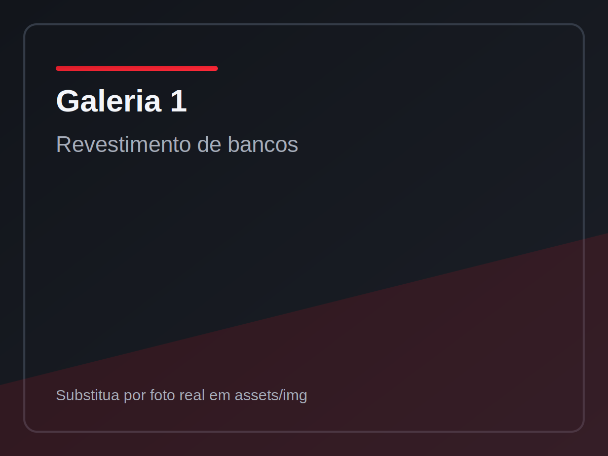

# Bancar Revestimentos Automotivos

Landing page institucional estática, moderna e responsiva para a **Bancar Revestimentos Automotivos**, com foco em:

- fortalecimento de marca
- cartão profissional digital
- conversão para WhatsApp
- divulgação de Instagram, serviços e localização

## Tecnologias

- HTML5
- CSS3
- JavaScript puro

Sem framework e sem backend. Pronto para publicar no GitHub Pages.

## Estrutura de pastas

```text
.
├── index.html
├── style.css
├── script.js
├── README.md
└── assets
    ├── icons
    │   ├── favicon.ico
    │   ├── bancar-favicon-16x16.png
    │   ├── bancar-favicon-32x32.png
    │   ├── bancar-favicon-48x48.png
    │   ├── bancar-favicon-192x192.png
    │   └── bancar-favicon-512x512.png
    └── img
        ├── bancar-cartao-logo-1083x633.png
        ├── bancar-site-hero-1600x600.png
        └── galeria-placeholder-*.svg
```

## Como editar WhatsApp, Instagram, e-mail e dados da loja

Edite o arquivo **`script.js`**, no bloco no topo chamado:

```js
const CONTACT_DATA = {
  whatsappUrl: "https://wa.me/5561981397819",
  whatsappMessage: "Olá! Quero um orçamento para revestimento automotivo.",
  instagramUrl: "https://instagram.com/bancar_couro",
  instagramHandle: "@bancar_couro",
  email: "romaoamorim@hotmail.com",
  phoneDisplay: "(61) 98139-7819",
  addressShort: "Praça 04, Setor Sul",
  addressFull: "Praça 04, Setor Sul, Gama - DF",
  city: "Gama - DF, Setor Sul",
  businessHours: "Segunda a sábado, 08h às 18h",
};
```

### Formatos recomendados

- WhatsApp: `https://wa.me/5500000000000`
- Instagram: `https://instagram.com/seuinstagram`
- E-mail: `seuemail@dominio.com`
- Telefone: `(00) 00000-0000`

## Como editar textos do site

- Títulos, subtítulos e parágrafos: editar em **`index.html`**.
- Estilos (cores, tipografia, espaçamentos): editar em **`style.css`**.
- Dados globais de contato: editar em **`script.js`**.

## Como trocar imagens

### Hero e logo

- Troque os arquivos em `assets/img` mantendo o mesmo nome
- ou altere os caminhos diretamente no `index.html`

### Galeria

No `index.html`, seção `#galeria`, cada card está com placeholder e comentário para troca.

Exemplo:

```html
<figure class="gallery-item">
  
  <figcaption>Revestimento de bancos</figcaption>
</figure>
```

Basta substituir o `src` por sua foto real (ex.: `assets/img/servico-bancos.jpg`) e ajustar o `alt`.

## Publicar no GitHub Pages

1. Crie um repositório no GitHub.
2. Envie os arquivos para a branch `main`.
3. No GitHub, abra: `Settings` > `Pages`.
4. Em **Build and deployment**:
   - `Source`: **Deploy from a branch**
   - `Branch`: **main**
   - `Folder`: **/ (root)**
5. Salve e aguarde a URL pública ser gerada.

## Observações

- O site já é mobile-first e responsivo.
- Há botão flutuante de WhatsApp para aumentar conversão.
- O ano no rodapé é atualizado automaticamente via JavaScript.
